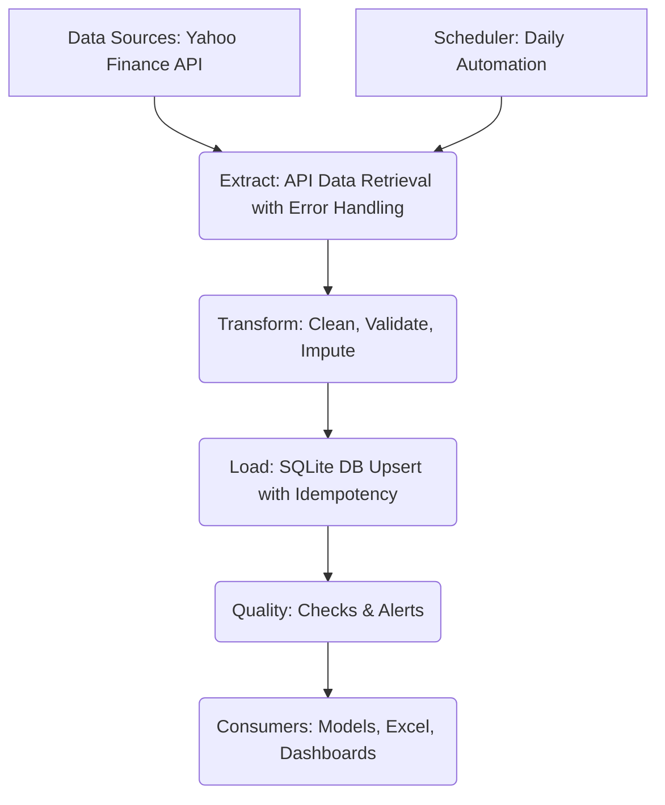

id: 698f9b2e53049d8a753b8e92_documentation
summary: Lab 10: Automating Data Ingestion Documentation
feedback link: https://docs.google.com/forms/d/e/1FAIpQLSfWkOK-in_bMMoHSZfcIvAeO58PAH9wrDqcxnJABHaxiDqhSA/viewform?usp=sf_link
environments: Web
status: Published
# QuLab: Building an Automated Data Ingestion Pipeline with Streamlit

## 1. Introduction to Automated Data Ingestion and ETL Concepts
Duration: 0:10:00

<aside class="positive">
This step provides the <b>context and importance</b> of automating data ingestion in finance, and introduces the core architectural principles. Developers will understand the business problem and the high-level solution before diving into the code.
</aside>

At Alpha Investments, the manual process of acquiring and inputting market data into spreadsheets has become a significant bottleneck. This repetitive task consumes valuable time, is prone to human error, and leads to inconsistent data, which is detrimental for investment decision-making and downstream AI/ML models. This codelab presents a solution: an automated, Python-based market data pipeline designed to streamline data ingestion, apply robust validation, and store information in a reliable database.

This application demonstrates a comprehensive workflow, from initial configuration to automated daily execution, embodying key data engineering principles relevant to financial professionals. By automating this crucial step, teams can pivot from low-value data wrangling to high-value analytical tasks, ensuring data integrity and scalability.

### 1.1. Core Problem: Manual Data Ingestion
The traditional manual approach, often involving copy-pasting from sources like Bloomberg or Refinitiv, introduces several challenges:
*   **Time Consumption**: Hours spent daily on mundane data entry.
*   **Human Error**: Inconsistent data, typos, and incorrect formatting.
*   **Scalability Issues**: Difficult to expand to more assets or data points.
*   **Lack of Auditability**: No clear record of data changes or sources.
*   **Delayed Insights**: Data is not available promptly for analysis.

### 1.2. The Solution: An Automated ETL Pipeline
This codelab focuses on building an Extract, Transform, Load (ETL) pipeline. ETL is a three-stage process used to integrate data from multiple sources into a data warehouse or database.

*   **Extract**: Retrieving data from its source (e.g., financial APIs).
*   **Transform**: Cleaning, validating, enriching, and standardizing the data.
*   **Load**: Storing the processed data into a target system (e.g., SQLite database).

The pipeline also incorporates critical components like quality checks, performance monitoring, and robust logging to ensure data integrity and operational efficiency.

### 1.3. ETL Architecture Overview (V1)
The automated market data pipeline follows an Extract-Transform-Load (ETL) pattern, integrating robust quality checks and scheduled execution. This diagram illustrates the flow of data from its source to its consumption by downstream models and dashboards. The system ensures a resilient and auditable data supply.



**Key Stages Explained:**
*   **Data Sources**: External APIs (like Yahoo Finance) providing raw market data.
*   **Extract**: Data is fetched from financial APIs, incorporating retry logic to handle transient network issues or API rate limits.
*   **Transform**: Raw data undergoes crucial cleaning and validation steps, including removing duplicates, handling missing prices (e.g., forward-fill), and flagging extreme price movements.
*   **Load**: Cleaned and validated data is stored idempotently into a local SQLite database, preventing duplicate records on re-runs and ensuring data integrity.
*   **Quality**: Automated checks are performed post-load to verify data freshness, completeness, price validity, and to detect anomalous movements. Alerts are generated if issues are found.
*   **Scheduler**: The entire pipeline is orchestrated to run automatically at a predefined schedule, typically daily after market close. This is simulated by a manual trigger in the Streamlit app.
*   **Consumers**: The high-quality, reliable data from the database feeds directly into downstream investment models, analytical dashboards, and other firm-wide systems.

## 2. Setting Up Your Development Environment
Duration: 0:08:00

To get started, you'll need Python installed on your system. We will create a project structure and install the necessary libraries.

### 2.1. Prerequisites

*   **Python 3.8+**: Ensure you have a recent version of Python installed.
*   **pip**: Python's package installer, usually comes with Python.

### 2.2. Project Setup

Create a new directory for your project and navigate into it:

```bash
mkdir market_data_pipeline
cd market_data_pipeline
```

Inside this directory, create two Python files: `app.py` (for the Streamlit application) and `source.py` (for the core data pipeline logic). You will also need a `requirements.txt` file.

```bash
touch app.py
touch source.py
touch requirements.txt
```

### 2.3. Installing Dependencies

Open `requirements.txt` and add the following libraries:

```
streamlit
pandas
numpy
matplotlib
seaborn
yfinance # For data extraction
```

Now, install these dependencies using pip:

```bash
pip install -r requirements.txt
```

### 2.4. `source.py` - Core Pipeline Logic

The `source.py` file contains all the business logic for the data pipeline, including configuration, data fetching, transformation, loading, quality checks, and ROI calculation. For demonstration purposes, we will use `yfinance` to fetch real market data.

<aside class="negative">
<b>Important:</b> The provided `source.py` uses `yfinance` for data extraction. While excellent for educational purposes and rapid prototyping, `yfinance` is an unofficial API and might have limitations or stability issues for production use cases. Refer to the "Free vs. Paid Data" section later for production considerations.
</aside>

Copy the following code into your `source.py` file:

```python
import yfinance as yf
import pandas as pd
import numpy as np
import sqlite3
import os
import datetime as dt
from datetime import datetime, timedelta
import logging
import time

#  Configuration 
CONFIG = {
    'tickers': ['AAPL', 'MSFT', 'GOOGL', 'AMZN', 'TSLA', 'NVDA'],
    'db_path': 'market_data.db',
    'csv_backup_dir': 'csv_backups',
    'log_file': 'pipeline.log',
    'logger_name': 'data_pipeline',
    'lookback_days': 365 * 5, # Fetch data for last 5 years initially
    'T_manual': 0.5, # Daily manual effort in hours
    'D_annual': 252, # Annual trading days
    'T_setup': 40, # One-time pipeline development cost in hours
    'T_maint': 10, # Annual maintenance effort in hours
    'manual_error_rate_per_day': 0.01, # % of manual errors per day
    'automated_error_rate_per_day': 0.0001, # % of automated errors per day
    'max_missing_pct': 0.02, # Max allowed missing data % for completeness check
    'max_price_change_pct': 0.15 # Max allowed daily price change % for validity check
}

#  Initialize Logger 
# Ensure the log directory exists if specified in log_file path
log_dir = os.path.dirname(CONFIG['log_file'])
if log_dir and not os.path.exists(log_dir):
    os.makedirs(log_dir)

logging.basicConfig(
    filename=CONFIG['log_file'],
    level=logging.INFO,
    format='%(asctime)s | %(levelname)s | %(name)s | %(message)s'
)
app_logger = logging.getLogger(CONFIG['logger_name'])

#  Global State for Streamlit App (initial load) 
quality_summary_df = pd.DataFrame()
annual_time_saved = 0
manual_errors = 0
automated_errors = 0
db_ok = False # Database integrity check status

#  Database Operations 
def initialize_db():
    """Initializes the SQLite database and creates the market_data table."""
    app_logger.info(f"Initializing database at {CONFIG['db_path']}")
    conn = None
    try:
        conn = sqlite3.connect(CONFIG['db_path'])
        cursor = conn.cursor()
        cursor.execute("""
            CREATE TABLE IF NOT EXISTS market_data (
                ticker TEXT NOT NULL,
                date TEXT NOT NULL,
                open REAL,
                high REAL,
                low REAL,
                close REAL,
                adj_close REAL,
                volume INTEGER,
                dividend REAL,
                stock_splits REAL,
                updated_at TEXT DEFAULT CURRENT_TIMESTAMP,
                PRIMARY KEY (ticker, date)
            )
        """)
        conn.commit()
        app_logger.info("Database 'market_data' table ensured to exist.")
    except sqlite3.Error as e:
        app_logger.error(f"Error initializing database: {e}", exc_info=True)
        raise
    finally:
        if conn:
            conn.close()

def load_data(conn, df_data):
    """Loads (upserts) the DataFrame into the SQLite market_data table."""
    if df_data.empty:
        app_logger.warning("No data to load into the database.")
        return

    app_logger.info(f"Loading {len(df_data)} records for {df_data['ticker'].nunique()} tickers.")
    df_data['updated_at'] = datetime.now().strftime("%Y-%m-%d %H:%M:%S")

    # Use a faster upsert method: INSERT OR REPLACE
    # This assumes we want to replace existing data for a ticker-date if new data comes.
    # For daily data, this handles re-runs and late-arriving corrections.
    try:
        df_data.to_sql('market_data', conn, if_exists='append', index=False)
        # Handle duplicates with ON CONFLICT clause for a true UPSERT (requires newer SQLite or custom logic)
        # For simplicity and broad compatibility, we'll rely on unique constraint and then delete/insert for true upsert,
        # or use a temp table for larger datasets.
        # However, `to_sql(if_exists='append')` with a primary key will throw an error on conflict by default
        # unless PRAGMA ignore_check_constraints is set or a specific conflict resolution is used.
        # A robust UPSERT for SQLite with pandas:
        
        # Create a temporary table for new data
        df_data.to_sql('temp_market_data', conn, if_exists='replace', index=False)

        # Insert new data, updating if primary key (ticker, date) already exists
        cursor = conn.cursor()
        cursor.execute("""
            INSERT OR REPLACE INTO market_data (ticker, date, open, high, low, close, adj_close, volume, dividend, stock_splits, updated_at)
            SELECT ticker, date, open, high, low, close, adj_close, volume, dividend, stock_splits, updated_at
            FROM temp_market_data
        """)
        conn.commit()
        cursor.execute("DROP TABLE temp_market_data")
        app_logger.info(f"Successfully loaded/upserted data for {df_data['ticker'].nunique()} tickers.")
    except sqlite3.Error as e:
        app_logger.error(f"Error loading data into database: {e}", exc_info=True)
        raise

#  Extract & Transform 
def fetch_data(ticker, start_date_str, end_date_str):
    """Fetches historical market data for a given ticker."""
    app_logger.info(f"Fetching data for {ticker} from {start_date_str} to {end_date_str}")
    try:
        # Retry mechanism
        max_retries = 3
        for attempt in range(max_retries):
            try:
                data = yf.download(ticker, start=start_date_str, end=end_date_str, progress=False)
                if not data.empty:
                    data = data.reset_index()
                    data.columns = [col.lower().replace(' ', '_') for col in data.columns]
                    data['ticker'] = ticker
                    data['date'] = data['date'].dt.strftime('%Y-%m-%d') # Ensure date format
                    app_logger.info(f"Successfully fetched {len(data)} records for {ticker}.")
                    return data
                else:
                    app_logger.warning(f"No data returned for {ticker} in the range {start_date_str}-{end_date_str}. Attempt {attempt + 1}/{max_retries}")
                    time.sleep(1) # Wait before retry
            except Exception as e_inner:
                app_logger.warning(f"Attempt {attempt + 1}/{max_retries} failed for {ticker}: {e_inner}")
                time.sleep(2 ** attempt) # Exponential backoff
        app_logger.error(f"Failed to fetch data for {ticker} after {max_retries} attempts.")
        return pd.DataFrame()
    except Exception as e:
        app_logger.error(f"Error in fetch_data for {ticker}: {e}", exc_info=True)
        return pd.DataFrame()

def clean_and_transform_data(df):
    """Applies basic cleaning and transformation rules."""
    if df.empty:
        return df

    app_logger.info(f"Cleaning and transforming data for {df['ticker'].iloc[0] if not df.empty else 'N/A'}")

    # Drop potential duplicates based on ticker and date
    initial_rows = len(df)
    df.drop_duplicates(subset=['ticker', 'date'], inplace=True)
    if len(df) < initial_rows:
        app_logger.warning(f"Removed {initial_rows - len(df)} duplicate records.")

    # Convert date to datetime if not already (important for sorting/time series operations)
    df['date'] = pd.to_datetime(df['date'])
    df = df.sort_values(by=['ticker', 'date']).reset_index(drop=True)

    # Impute missing prices (forward fill)
    for col in ['open', 'high', 'low', 'close', 'adj_close', 'volume']:
        if df[col].isnull().any():
            app_logger.warning(f"Missing values found in '{col}'. Forward filling.")
            df[col] = df[col].ffill()
            # If still NaNs at the beginning, try backward fill
            if df[col].isnull().any():
                df[col] = df[col].bfill()

    # Drop rows where critical 'close' price is still NaN (should be rare after ffill/bfill)
    df.dropna(subset=['close'], inplace=True)

    # Ensure numeric types
    numeric_cols = ['open', 'high', 'low', 'close', 'adj_close', 'volume', 'dividend', 'stock_splits']
    for col in numeric_cols:
        if col in df.columns:
            df[col] = pd.to_numeric(df[col], errors='coerce')

    return df

#  Quality Checks 
def run_quality_checks(conn, tickers, config):
    """Performs various data quality checks and returns a summary DataFrame."""
    app_logger.info("Running data quality checks.")
    quality_results = []
    today = datetime.now().date()
    yesterday = today - timedelta(days=1)
    
    for ticker in tickers:
        ticker_summary = {'ticker': ticker}
        df_ticker = pd.read_sql(f"SELECT date, close FROM market_data WHERE ticker='{ticker}' ORDER BY date DESC", conn, parse_dates=['date'])
        
        if df_ticker.empty:
            app_logger.warning(f"No data for {ticker} found in DB for quality checks.")
            quality_results.append({
                'ticker': ticker, 'fresh': 0, 'complete': 0.0, 'valid_prices': 0, 'no_extreme_moves': 0, 'issue_description': 'No data found'
            })
            continue

        latest_date = df_ticker['date'].max().date()
        oldest_date = df_ticker['date'].min().date()
        
        # Freshness Check: Latest date is recent (e.g., within last 2 trading days)
        # More robust check would use a calendar to account for weekends/holidays
        fresh_check = 1 if latest_date >= yesterday else 0
        ticker_summary['fresh'] = fresh_check

        # Completeness Check: How many trading days in the last 30 have data
        # Approximate expected business days (excluding weekends)
        expected_business_days_period = pd.bdate_range(end=latest_date, periods=30)
        actual_days_with_data = df_ticker[df_ticker['date'] >= (latest_date - timedelta(days=30))]['date'].nunique()
        completeness_ratio = actual_days_with_data / len(expected_business_days_period) if len(expected_business_days_period) > 0 else 0
        ticker_summary['completeness'] = completeness_ratio
        
        # Valid Prices Check: All close prices are positive
        valid_prices_check = 1 if (df_ticker['close'] > 0).all() else 0
        ticker_summary['valid_prices'] = valid_prices_check

        # No Extreme Moves Check: Daily price change within limits
        df_ticker['prev_close'] = df_ticker['close'].shift(1)
        df_ticker['daily_change'] = (df_ticker['close'] - df_ticker['prev_close']) / df_ticker['prev_close']
        # Filter out NaN from the first row's change
        extreme_moves = df_ticker['daily_change'].abs().max() > config['max_price_change_pct'] if not df_ticker['daily_change'].isnull().all() else False
        no_extreme_moves_check = 0 if extreme_moves else 1
        ticker_summary['no_extreme_moves'] = no_extreme_moves_check

        # Issue Description
        issues = []
        if fresh_check == 0: issues.append('Data not fresh')
        if completeness_ratio < (1 - config['max_missing_pct']): issues.append('Data incompleteness')
        if valid_prices_check == 0: issues.append('Invalid prices')
        if no_extreme_moves_check == 0: issues.append('Extreme price moves detected')
        
        ticker_summary['issue_description'] = ', '.join(issues) if issues else 'None'
        
        quality_results.append(ticker_summary)

    return pd.DataFrame(quality_results)

#  ROI Calculation 
def calculate_roi(config):
    """Calculates ROI metrics based on configured parameters."""
    app_logger.info("Calculating ROI metrics.")
    # Calculate total annual hours for manual process
    total_manual_hours_annual = config['T_manual'] * config['D_annual']

    # Calculate total annual hours for automated process (setup amortized over 3 years, plus annual maintenance)
    # Simplified ROI: Annual hours for automated process = (T_setup / 3) + T_maint
    # More complex models can factor in benefits over a longer horizon.
    total_automated_hours_annual = (config['T_setup'] / 3) + config['T_maint'] # Amortize setup over 3 years

    annual_time_saved = total_manual_hours_annual - total_automated_hours_annual

    # Calculate errors eliminated
    manual_errors_per_day = config['T_manual'] * 60 * config['manual_error_rate_per_day'] # Assuming 1 error per X minutes manual work
    automated_errors_per_day = config['T_manual'] * 60 * config['automated_error_rate_per_day'] # Assuming small residual error

    app_logger.info(f"Annual time saved: {annual_time_saved:.2f} hours.")
    app_logger.info(f"Manual errors per day: {manual_errors_per_day:.2f}, Automated errors per day: {automated_errors_per_day:.4f}")
    
    return annual_time_saved, manual_errors_per_day, automated_errors_per_day

#  System Integrity Checks (Mimicking Pytest) 
def verify_db_integrity(db_path):
    """
    Performs integrity checks on the database mimicking pytest-like assertions.
    Returns True if all checks pass, False otherwise.
    """
    app_logger.info(f"Verifying database integrity for {db_path}")
    conn = None
    try:
        conn = sqlite3.connect(db_path)
        cursor = conn.cursor()

        # Check 1: Table exists
        cursor.execute("SELECT name FROM sqlite_master WHERE type='table' AND name='market_data';")
        if cursor.fetchone() is None:
            app_logger.error("Integrity Check Failed: 'market_data' table does not exist.")
            return False

        # Check 2: Database contains data
        cursor.execute("SELECT COUNT(*) FROM market_data;")
        if cursor.fetchone()[0] == 0:
            app_logger.warning("Integrity Check Warning: 'market_data' table is empty.")
            # This might be acceptable for a fresh run, but critical in production
            # For this context, we'll let it pass but log a warning.
            pass

        # Check 3: Data for a sufficient number of tickers
        cursor.execute("SELECT COUNT(DISTINCT ticker) FROM market_data;")
        num_tickers_in_db = cursor.fetchone()[0]
        if num_tickers_in_db < len(CONFIG['tickers']):
            app_logger.warning(f"Integrity Check Warning: Data for only {num_tickers_in_db} out of {len(CONFIG['tickers'])} configured tickers found.")
            # This might happen if fetching for some tickers failed. Not a critical failure for integrity.
            pass

        # Check 4: No records found with future dates
        current_date_str = datetime.now().strftime('%Y-%m-%d')
        cursor.execute(f"SELECT COUNT(*) FROM market_data WHERE date > '{current_date_str}';")
        if cursor.fetchone()[0] > 0:
            app_logger.error("Integrity Check Failed: Future dates found in 'market_data' table.")
            return False

        # Check 5: All closing prices are positive values
        cursor.execute("SELECT COUNT(*) FROM market_data WHERE close <= 0;")
        if cursor.fetchone()[0] > 0:
            app_logger.error("Integrity Check Failed: Non-positive closing prices found in 'market_data' table.")
            return False

        # Check 6: No duplicate (ticker, date) pairs found (ensuring idempotency)
        # This is implicitly handled by PRIMARY KEY (ticker, date) and INSERT OR REPLACE
        # But we can explicitly check if any duplicates exist without the PK constraint
        cursor.execute("SELECT ticker, date, COUNT(*) FROM market_data GROUP BY ticker, date HAVING COUNT(*) > 1;")
        if cursor.fetchone() is not None:
            app_logger.error("Integrity Check Failed: Duplicate (ticker, date) pairs found in 'market_data' table.")
            return False

        app_logger.info("All database integrity checks PASSED.")
        return True

    except sqlite3.Error as e:
        app_logger.critical(f"Database integrity check failed due to a SQL error: {e}", exc_info=True)
        return False
    except Exception as e:
        app_logger.critical(f"Database integrity check failed due to an unexpected error: {e}", exc_info=True)
        return False
    finally:
        if conn:
            conn.close()

#  Main Pipeline Orchestrator 
def run_pipeline():
    """Orchestrates the full ETL pipeline."""
    global quality_summary_df, annual_time_saved, manual_errors, automated_errors, db_ok
    app_logger.info(" Starting Full ETL Pipeline Run ")
    start_time = time.time()

    initialize_db()
    conn = None
    try:
        conn = sqlite3.connect(CONFIG['db_path'])
        
        all_fetched_data = pd.DataFrame()
        end_date = datetime.now().strftime('%Y-%m-%d')
        start_date = (datetime.now() - timedelta(days=CONFIG['lookback_days'])).strftime('%Y-%m-%d')

        for ticker in CONFIG['tickers']:
            df_raw = fetch_data(ticker, start_date, end_date)
            if not df_raw.empty:
                df_transformed = clean_and_transform_data(df_raw)
                if not df_transformed.empty:
                    # Append transformed data for loading
                    all_fetched_data = pd.concat([all_fetched_data, df_transformed], ignore_index=True)
                else:
                    app_logger.warning(f"No transformed data for {ticker}.")
            else:
                app_logger.warning(f"No raw data fetched for {ticker}.")

        if not all_fetched_data.empty:
            load_data(conn, all_fetched_data)
        else:
            app_logger.warning("No data collected across all tickers to load into DB.")

        # Run quality checks after loading
        quality_summary_df = run_quality_checks(conn, CONFIG['tickers'], CONFIG)
        
        # Calculate ROI
        annual_time_saved, manual_errors, automated_errors = calculate_roi(CONFIG)

        # Verify DB integrity
        db_ok = verify_db_integrity(CONFIG['db_path'])

    except Exception as e:
        app_logger.critical(f"Pipeline encountered a critical error: {e}", exc_info=True)
        db_ok = False # Mark DB as not OK if pipeline failed
        raise # Re-raise to show in Streamlit
    finally:
        if conn:
            conn.close()
        app_logger.info(f" ETL Pipeline Finished in {time.time() - start_time:.2f} seconds ")

#  Initial Pipeline Run on App Start 
# This block runs once when the Streamlit app starts, to populate initial state.
# It's important to do this outside `if __name__ == "__main__":` because Streamlit re-runs the script.
initialize_db()
try:
    # Check if DB has any data at all before running full pipeline on startup
    # This prevents running a full historical fetch every time Streamlit reloads
    conn_check = sqlite3.connect(CONFIG['db_path'])
    cursor_check = conn_check.cursor()
    cursor_check.execute("SELECT COUNT(*) FROM market_data;")
    row_count = cursor_check.fetchone()[0]
    conn_check.close()

    if row_count > 0:
        app_logger.info("Database already contains data. Running quality checks and ROI only on startup.")
        conn_initial = sqlite3.connect(CONFIG['db_path'])
        quality_summary_df = run_quality_checks(conn_initial, CONFIG['tickers'], CONFIG)
        annual_time_saved, manual_errors, automated_errors = calculate_roi(CONFIG)
        db_ok = verify_db_integrity(CONFIG['db_path'])
        conn_initial.close()
    else:
        app_logger.info("Database is empty or newly created. Running full initial pipeline.")
        run_pipeline()
        # After run_pipeline, globals are already set.
except Exception as e:
    app_logger.error(f"Initial pipeline run on startup failed: {e}", exc_info=True)
    # Ensure globals are sensible defaults on failure
    quality_summary_df = pd.DataFrame()
    annual_time_saved = 0
    manual_errors = 0
    automated_errors = 0
    db_ok = False

```

### 2.5. `app.py` - Streamlit User Interface

The `app.py` file builds the interactive Streamlit dashboard that allows users to trigger the pipeline, view data, and analyze results.

Copy the following code into your `app.py` file:

```python
import streamlit as st
import pandas as pd
import numpy as np
import matplotlib.pyplot as plt
import seaborn as sns
import sqlite3
import os
import datetime as dt
from datetime import datetime, timedelta
import logging
import time

# Import business logic
from source import *

# Initialize logger (if not already initialized by source.py's global scope)
try:
    app_logger = logging.getLogger(CONFIG['logger_name'])
except NameError:
    # Fallback if CONFIG is not yet loaded for some reason (unlikely with from source import *)
    logging.basicConfig(level=logging.INFO, format='%(asctime)s | %(levelname)s | %(message)s')
    app_logger = logging.getLogger('streamlit_app_fallback')


st.set_page_config(page_title="QuLab: Lab 10: Automating Data Ingestion", layout="wide")
st.sidebar.image("https://www.quantuniversity.com/assets/img/logo5.jpg")
st.sidebar.divider()
st.title("QuLab: Lab 10: Automating Data Ingestion")
st.divider()

# Session State Initialization
if 'page' not in st.session_state:
    st.session_state.page = 'Overview'

if 'config' not in st.session_state:
    # CONFIG is imported from source
    st.session_state.config = CONFIG.copy()

if 'initial_pipeline_run_done' not in st.session_state:
    # This flag ensures initial run status is correctly reflected
    st.session_state.initial_pipeline_run_done = True
    st.session_state.pipeline_last_run_status = "Initial run on app start (from source.py execution)."
    st.session_state.pipeline_last_run_timestamp = datetime.now().strftime("%Y-%m-%d %H:%M:%S")

    # Access globals imported from source.py after its initial execution
    st.session_state.quality_summary_df = globals().get('quality_summary_df', pd.DataFrame()).copy()
    st.session_state.annual_time_saved = globals().get('annual_time_saved', 0)
    st.session_state.manual_errors = globals().get('manual_errors', 0)
    st.session_state.automated_errors = globals().get('automated_errors', 0)
    st.session_state.db_verified = globals().get('db_ok', False)

if 'selected_tickers' not in st.session_state:
    st.session_state.selected_tickers = st.session_state.config['tickers'][:3]

if 'raw_data_viewer_tickers' not in st.session_state:
    st.session_state.raw_data_viewer_tickers = st.session_state.config['tickers'][:1]

if 'raw_data_viewer_start_date' not in st.session_state:
    st.session_state.raw_data_viewer_start_date = (datetime.now() - timedelta(days=30)).date()

if 'raw_data_viewer_end_date' not in st.session_state:
    st.session_state.raw_data_viewer_end_date = datetime.now().date()

if 'pipeline_log_content' not in st.session_state:
    try:
        with open(st.session_state.config['log_file'], 'r') as f:
            st.session_state.pipeline_log_content = f.read()
    except FileNotFoundError:
        st.session_state.pipeline_log_content = "Log file not found or pipeline not run yet."

# Sidebar
st.sidebar.title("Navigation")
page_options = [
    "Overview",
    "Run Pipeline",
    "Data Verification & Quality",
    "Performance & ROI",
    "System Integrity & Production"
]

# Use a temporary variable for the radio widget to handle the state update
current_page_index = page_options.index(st.session_state.page) if st.session_state.page in page_options else 0
selected_page = st.sidebar.radio("Go to", page_options, index=current_page_index)
if selected_page != st.session_state.page:
    st.session_state.page = selected_page
    st.rerun()

st.sidebar.header("Pipeline Configuration")
selected_sidebar_tickers = st.sidebar.multiselect(
    "Select Tickers for Analysis",
    options=st.session_state.config['tickers'],
    default=st.session_state.selected_tickers
)

if selected_sidebar_tickers != st.session_state.selected_tickers:
    st.session_state.selected_tickers = selected_sidebar_tickers
    st.rerun()

st.sidebar.markdown("")
st.sidebar.subheader("Current Pipeline Settings")
for key, value in st.session_state.config.items():
    if key not in ['tickers', 'db_path', 'csv_backup_dir', 'log_file', 'logger_name']:
        st.sidebar.markdown(f"**{key.replace('_', ' ').title()}:** `{value}`")
st.sidebar.markdown(f"**Database Path:** `{st.session_state.config['db_path']}`")
st.sidebar.markdown(f"**Log File:** `{st.session_state.config['log_file']}`")

# Page Content
if st.session_state.page == "Overview":
    st.markdown(f"### Automating Market Data Ingestion for Investment Research") 

    st.markdown(f"""
        At Alpha Investments, the daily ritual of manually copying and pasting market data
        from sources like Bloomberg or Refinitiv into Excel spreadsheets has become a significant bottleneck.
        This process is not only time-consuming, consuming precious hours that could be spent on high-value
        analytical tasks, but it's also prone to human error, leading to inconsistent data across various
        valuation models and dashboards. As a CFA Charterholder, Sri understands the critical importance
        of reliable data as the foundation for all investment decisions and subsequent AI/ML models.

        This application demonstrates an automated, Python-based market data pipeline. This pipeline
        connects to financial APIs, ingests daily OHLCV, fundamental, and macroeconomic data, applies
        robust data cleaning and validation rules, stores the data in a local SQLite database,
        and generates automated quality reports. By doing so, Sri aims to liberate his team from
        low-value data wrangling, drastically reduce errors, and establish a scalable, auditable
        data infrastructure. This hands-on journey will demonstrate a real-world workflow, from
        initial configuration to automated daily execution, embodying key data engineering principles
        relevant to financial professionals.
    """)

    st.subheader("1. ETL Architecture Overview (V1)")
    st.markdown(f"""
        The automated market data pipeline follows an Extract-Transform-Load (ETL) pattern,
        integrating robust quality checks and scheduled execution.
        This diagram illustrates the flow of data from its source to its consumption by downstream models and dashboards.
        The system ensures a resilient and auditable data supply.
    """)
    
    st.markdown(
        """
        ```mermaid
        graph TD
            A[Data Sources: Yahoo Finance API] --> B(Extract: API Data Retrieval with Error Handling)
            B --> C(Transform: Clean, Validate, Impute)
            C --> D(Load: SQLite DB Upsert with Idempotency)
            D --> E(Quality: Checks & Alerts)
            E --> F(Consumers: Models, Excel, Dashboards)
            G[Scheduler: Daily Automation] --> B
        ```
        """
    )
    st.markdown(f"""
        **Key Stages:**
        *   **Extract**: Data is fetched from financial APIs, incorporating retry logic to handle transient network issues or API rate limits.
        *   **Transform**: Raw data undergoes crucial cleaning and validation steps, including removing duplicates, handling missing prices (e.g., forward-fill), and flagging extreme price movements.
        *   **Load**: Cleaned and validated data is stored idempotently into a local SQLite database, preventing duplicate records on re-runs and ensuring data integrity.
        *   **Quality**: Automated checks are performed post-load to verify data freshness, completeness, price validity, and to detect anomalous movements.
        *   **Scheduler**: The entire pipeline is orchestrated to run automatically at a predefined schedule, typically daily after market close.
        *   **Consumers**: The high-quality, reliable data from the database feeds directly into downstream investment models, analytical dashboards, and other firm-wide systems.
    """)

elif st.session_state.page == "Run Pipeline":
    st.header("Automated Market Data Pipeline Execution")
    st.markdown(f"""
        This section allows you to manually trigger the full ETL pipeline execution.
        In a production environment, this pipeline would typically run automatically
        on a schedule (e.g., daily after market close).
        """)

    st.info(f"**Last Pipeline Run:** {st.session_state.pipeline_last_run_timestamp} | Status: {st.session_state.pipeline_last_run_status}")

    if st.button("Run Full ETL Pipeline Now"):
        with st.spinner("Running the pipeline... This might take a moment."):
            try:
                run_pipeline()

                # After run_pipeline, the global variables are updated in source.py
                # We need to refresh them in Streamlit's session state.
                # Re-connect to DB to ensure latest data for quality checks if globals aren't directly updated here
                conn_after_run = sqlite3.connect(st.session_state.config['db_path'])
                st.session_state.quality_summary_df = run_quality_checks(conn_after_run, st.session_state.config['tickers'], st.session_state.config)
                conn_after_run.close()

                st.session_state.annual_time_saved, st.session_state.manual_errors, st.session_state.automated_errors = calculate_roi(st.session_state.config)
                st.session_state.db_verified = verify_db_integrity(st.session_state.config['db_path'])

                try:
                    with open(st.session_state.config['log_file'], 'r') as f:
                        st.session_state.pipeline_log_content = f.read()
                except FileNotFoundError:
                    st.session_state.pipeline_log_content = "Log file not found after run."

                st.session_state.pipeline_last_run_status = "Successfully completed."
                st.session_state.pipeline_last_run_timestamp = datetime.now().strftime("%Y-%m-%d %H:%M:%S")

                st.success("Pipeline executed successfully!")
                st.balloons()
                st.rerun()

            except Exception as e:
                st.session_state.pipeline_last_run_status = f"Failed with error: {e}"
                st.error(f"Pipeline execution failed: {e}")
                app_logger.critical(f"Streamlit pipeline trigger failed: {e}", exc_info=True)

    st.subheader("Latest Pipeline Run Details")
    st.markdown(f"**Last Updated:** {st.session_state.pipeline_last_run_timestamp}")

    if not st.session_state.quality_summary_df.empty:
        st.markdown("#### Latest Quality Check Summary")
        st.dataframe(st.session_state.quality_summary_df)
    else:
        st.warning("No quality check summary available. Run the pipeline first.")

    st.markdown("#### Pipeline Execution Log (Latest)")
    st.code(st.session_state.pipeline_log_content, height=300)

elif st.session_state.page == "Data Verification & Quality":
    st.header("Data Verification and Quality Assurance")
    st.markdown(f"""
        Ensuring high data quality is paramount for any investment decision.
        This section provides an interactive dashboard to verify the ingested market data
        and monitor its quality metrics, directly reflecting the 'Transform' and 'Quality' stages.
    """)

    st.subheader("Raw Market Data Viewer")
    st.markdown(f"""
        Browse the raw OHLCV data directly from the `market_data.db` database.
        This allows for quick spot-checks of recently ingested data for selected tickers and date ranges.
    """)
    viewer_tickers_options = st.multiselect(
        "Select Ticker(s) for Raw Data View",
        options=st.session_state.config['tickers'],
        default=st.session_state.raw_data_viewer_tickers
    )
    
    if viewer_tickers_options != st.session_state.raw_data_viewer_tickers:
        st.session_state.raw_data_viewer_tickers = viewer_tickers_options
        # st.rerun() # Not strictly necessary if button is used, but good for sync.

    col1, col2 = st.columns(2)
    with col1:
        viewer_start_date_input = st.date_input(
            "Start Date (Raw Data Viewer)",
            value=st.session_state.raw_data_viewer_start_date,
            max_value=datetime.now().date()
        )
        if viewer_start_date_input != st.session_state.raw_data_viewer_start_date:
            st.session_state.raw_data_viewer_start_date = viewer_start_date_input
    with col2:
        viewer_end_date_input = st.date_input(
            "End Date (Raw Data Viewer)",
            value=st.session_state.raw_data_viewer_end_date,
            max_value=datetime.now().date()
        )
        if viewer_end_date_input != st.session_state.raw_data_viewer_end_date:
            st.session_state.raw_data_viewer_end_date = viewer_end_date_input

    if st.button("Load Raw Data for View"):
        if st.session_state.raw_data_viewer_tickers:
            conn_raw_viewer = sqlite3.connect(st.session_state.config['db_path'])
            query = f"""
                SELECT ticker, date, open, high, low, close, volume, dividend, updated_at
                FROM market_data
                WHERE ticker IN ({','.join([f"'{t}'" for t in st.session_state.raw_data_viewer_tickers])})
                AND date BETWEEN '{st.session_state.raw_data_viewer_start_date.strftime('%Y-%m-%d')}' AND '{st.session_state.raw_data_viewer_end_date.strftime('%Y-%m-%d')}'
                ORDER BY ticker, date DESC
            """
            try:
                df_raw = pd.read_sql(query, conn_raw_viewer, parse_dates=['date', 'updated_at'])
                if not df_raw.empty:
                    st.dataframe(df_raw)
                else:
                    st.warning("No data found for the selected tickers and date range.")
            except Exception as e:
                st.error(f"Error querying database: {e}")
            finally:
                conn_raw_viewer.close()
        else:
            st.warning("Please select at least one ticker to view raw data.")

    st.markdown("")
    st.subheader("2. Price Series Verification (V2)")
    st.markdown(f"""
        This line plot shows the most recent 30 days of closing price data for your selected tickers.
        It's a quick visual check to confirm that data is flowing accurately and consistently for key assets.
    """)
    st.markdown(f"**Selected Tickers (from sidebar):** {', '.join(st.session_state.selected_tickers)}")
    st.markdown(f"**Data displayed for:** Last 30 trading days.")

    if st.session_state.selected_tickers:
        conn_price_series = sqlite3.connect(st.session_state.config['db_path'])
        
        # Determine subplot layout
        n_tickers = len(st.session_state.selected_tickers)
        fig_price_series, axes = plt.subplots(n_tickers, 1, figsize=(12, 4 * n_tickers), sharex=True)
        
        # Handle single ticker case where axes is not a list
        if n_tickers == 1:
            axes = [axes]

        for i, ticker in enumerate(st.session_state.selected_tickers):
            try:
                df_plot = pd.read_sql(
                    f"SELECT date, close FROM market_data WHERE ticker='{ticker}' ORDER BY date DESC LIMIT 30",
                    conn_price_series, parse_dates=['date']
                )
                if not df_plot.empty:
                    df_plot = df_plot.sort_values('date')
                    axes[i].plot(df_plot['date'], df_plot['close'], label=f'{ticker} Close Price', color='blue')
                    axes[i].set_title(f'{ticker} Last 30 Days Close Price')
                    axes[i].grid(True, linestyle='--', alpha=0.6)
                    axes[i].legend()
                else:
                    axes[i].set_title(f'No data for {ticker}')
                    axes[i].text(0.5, 0.5, 'No Data Available', horizontalalignment='center', verticalalignment='center', transform=axes[i].transAxes)
            except Exception as e:
                axes[i].set_title(f'Error loading {ticker}')
                app_logger.error(f"Error plotting {ticker}: {e}")

        plt.tight_layout()
        st.pyplot(fig_price_series)
        plt.close(fig_price_series)
        conn_price_series.close()
    else:
        st.info("Please select tickers in the sidebar to view price series.")


    st.markdown("")
    st.subheader("3. Quality Dashboard (V3)")
    st.markdown(f"""
        This heatmap visualizes the results of critical data quality checks for each ticker.
        It provides an immediate, color-coded overview of data health:
        *   **Green (1)**: Pass
        *   **Red (0)**: Fail
    """)
    if not st.session_state.quality_summary_df.empty:
        fig_heatmap = plt.figure(figsize=(10, 8))
        check_cols = ['fresh', 'valid_prices', 'no_extreme_moves'] # 'complete' is a ratio, not 0/1, so excluded from direct heatmap
        
        # Ensure these columns exist
        available_cols = [c for c in check_cols if c in st.session_state.quality_summary_df.columns]
        
        if available_cols:
            df_heatmap_plot = st.session_state.quality_summary_df[['ticker'] + available_cols].copy()
            df_heatmap_plot[available_cols] = df_heatmap_plot[available_cols].astype(int)
            sns.heatmap(df_heatmap_plot.set_index('ticker')[available_cols], annot=True, cmap='RdYlGn', fmt='d', linewidths=.5, linecolor='black', ax=plt.gca())
            plt.title('Data Quality Check Heatmap (0=Fail, 1=Pass)')
            plt.ylabel('Ticker')
            plt.xlabel('Quality Metric')
            st.pyplot(fig_heatmap)
            plt.close(fig_heatmap)
        else:
            st.warning("Quality columns missing from summary or no quality data available.")
    else:
        st.warning("No quality summary available. Run the pipeline first.")

    st.markdown("")
    st.subheader("4. Data Completeness Over Time (V5)")
    st.markdown(f"""
        Data completeness is crucial. This chart displays the Data Completeness Ratio ($C_i$)
        for a selected ticker, confirming consistent data delivery against an expected threshold.
        For each ticker $i$, the completeness ratio $C_i$ quantifies the proportion of actual trading days with data ($N_{{actual,i}}$) against the expected number of business days ($N_{{expected,i}}$) within a given date range.
    """)
    st.markdown(r"$$ C_i = \frac{N_{actual,i}}{N_{expected,i}} $$")
    st.markdown(r"where $N_{actual,i}$ is the number of actual trading days with data for ticker $i$, and $N_{expected,i}$ is the expected number of business days (excluding weekends) in the date range. A target of $C_i > 0.98$ is typically used, allowing for rare holidays or market closures that might not be captured as business days.")

    completeness_ticker_select = st.selectbox(
        "Select Ticker for Completeness Ratio View",
        options=st.session_state.config['tickers'],
        index=0
    )

    if completeness_ticker_select and not st.session_state.quality_summary_df.empty:
        current_completeness = 0.0
        if 'completeness' in st.session_state.quality_summary_df.columns:
             row = st.session_state.quality_summary_df[st.session_state.quality_summary_df['ticker'] == completeness_ticker_select]
             if not row.empty:
                 current_completeness = row['completeness'].iloc[0]

        fig_completeness = plt.figure(figsize=(10, 5))
        plt.bar(['Current Run'], [current_completeness], color='skyblue')
        plt.axhline(y=(1 - st.session_state.config.get('max_missing_pct', 0.02)), color='r', linestyle='--',
                    label=f'Target Completeness (>{(1 - st.session_state.config.get("max_missing_pct", 0.02)) * 100:.0f}%)')
        plt.title(f'Data Completeness Ratio for {completeness_ticker_select} (Current Run)')
        plt.ylabel('Completeness Ratio')
        plt.ylim(0, 1.05)
        plt.legend()
        plt.grid(axis='y', linestyle='--', alpha=0.7)
        st.pyplot(fig_completeness)
        plt.close(fig_completeness)
    elif completeness_ticker_select:
        st.warning(f"No quality summary available for {completeness_ticker_select}. Run the pipeline first.")
    else:
        st.info("No tickers available in configuration for completeness view.")

    st.markdown("")
    st.subheader("Latest Daily Data Quality Report")
    st.markdown(f"""
        This interactive table provides a detailed summary of the latest data quality checks,
        showing pass/fail status for each metric per ticker.
    """)
    if not st.session_state.quality_summary_df.empty:
        st.dataframe(st.session_state.quality_summary_df)
    else:
        st.info("No latest quality report available. Run the pipeline to generate one.")

elif st.session_state.page == "Performance & ROI":
    st.header("Pipeline Performance and Return on Investment (ROI)")
    st.markdown(f"""
        Understanding the operational efficiency and business value of automation is crucial.
        This section quantifies the ROI of the automated data pipeline and provides insights
        into its execution performance.
    """)

    st.subheader("1. Pipeline Execution Timeline (V4 - Partial)")
    st.markdown(f"""
        While `source.py` provides an overall pipeline execution time, direct step-by-step
        timing for a bar chart (V4) is not explicitly exposed by functions in `source.py`
        in a format directly suitable for a visual timeline.
        However, the `pipeline.log` provides timestamped entries for each major step,
        allowing for audit and manual analysis of performance bottlenecks.
        """)
    st.info(f"Overall Pipeline Run Status: **{st.session_state.pipeline_last_run_status}**")
    st.info(f"Last Pipeline Run Timestamp: **{st.session_state.pipeline_last_run_timestamp}**")
    st.markdown("Review the 'Pipeline Execution Log' below for detailed step timings and order of execution.")


    st.markdown("")
    st.subheader("2. ROI Comparison Chart (V6)")
    st.markdown(f"""
        Quantifying the Return on Investment (ROI) of automation provides a compelling business case.
        This chart visually compares the annual time investment for manual vs. automated data ingestion,
        highlighting the significant time savings and efficiency gains.
    """)
    st.markdown(f"""
        The time saved per year ($\Delta T$) is calculated by comparing the manual effort
        to the automated process, factoring in initial setup and ongoing maintenance costs:
    """)
    st.markdown(r"$$ \Delta T = (T_{manual} \times D_{annual}) - (T_{setup} / N_{amortization}) - T_{maint} $$")
    st.markdown(r"where $T_{manual}$ represents the daily manual effort (in hours), $D_{annual}$ is the annual number of trading days, $T_{setup}$ is the one-time pipeline development cost (in hours), $N_{amortization}$ is the number of years over which setup cost is amortized (e.g., 3 years), and $T_{maint}$ is the annual maintenance effort (in hours).")

    if st.session_state.annual_time_saved:
        manual_time_annual = st.session_state.config['T_manual'] * st.session_state.config['D_annual']
        automated_time_annual = (st.session_state.config['T_setup'] / 3) + st.session_state.config['T_maint']
        
        labels = ['Manual Process', 'Automated Pipeline']
        times = [manual_time_annual, automated_time_annual]

        fig_roi = plt.figure(figsize=(8, 6))
        plt.bar(labels, times, color=['lightcoral', 'lightseagreen'])
        plt.ylabel('Hours per Year')
        plt.title('Annual Time Investment: Manual vs. Automated Data Ingestion')
        
        for i, v in enumerate(times):
            plt.text(i, v + 10, f"{v:.1f} hrs", ha='center', va='bottom')
        
        plt.text(0.5, max(times) * 0.9, f"Savings: {st.session_state.annual_time_saved:.1f} hrs/year",
                 horizontalalignment='center', color='darkblue', fontsize=12, bbox=dict(facecolor='white', alpha=0.7))
        st.pyplot(fig_roi)
        plt.close(fig_roi)

        st.markdown(f"""
            **Calculated Annual Time Savings by Automation:** `{st.session_state.annual_time_saved:.2f}` hours/year.
            **Expected Daily Errors Eliminated (Manual vs. Automated):** `{st.session_state.manual_errors:.2f}` vs. `{st.session_state.automated_errors:.4f}`.
            This represents a significant reduction in potential data transcription errors, leading to more reliable investment models.
        """)
    else:
        st.warning("ROI figures not available. Please ensure the pipeline has run successfully.")

    st.markdown("")
    st.subheader("3. Pipeline Execution Log Viewer")
    st.markdown(f"""
        The pipeline generates a detailed log file (`{st.session_state.config['log_file']}`)
        that provides an audit trail of every execution step, warnings, and errors.
        This log is crucial for debugging, performance monitoring, and compliance purposes.
        """)
    st.code(st.session_state.pipeline_log_content, height=400)

elif st.session_state.page == "System Integrity & Production":
    st.header("System Integrity and Production Readiness")
    st.markdown(f"""
        Building a reliable data pipeline involves more than just scripting; it requires
        attention to system integrity, automated testing, and robust production deployment considerations.
    """)

    st.subheader("1. Pytest Results Summary")
    st.markdown(f"""
        Automated data quality tests, often implemented using frameworks like Pytest,
        are critical for ensuring the integrity of the data stored in the database.
        These tests provide a clear indication of the pass/fail status of the data structure and content,
        acting as a safeguard against corrupted or incomplete data.
    """)
    if st.session_state.db_verified:
        st.success("All automated database integrity checks PASSED successfully! Data is confirmed ready for downstream use.")
        st.markdown(f"""
            The following key integrity checks were performed (as defined in `source.py`'s `verify_db_integrity` function):
            *   Database table 'market_data' exists.
            *   Database contains data for a sufficient number of tickers.
            *   No records found with future dates.
            *   All closing prices are positive values.
            *   No duplicate (ticker, date) pairs found, confirming idempotency.
        """)
    else:
        st.error("Database integrity issues detected. Please review the pipeline execution logs and the raw data for errors.")
        st.warning("It is recommended to run the pipeline again to potentially resolve any underlying data integrity problems.")


    st.markdown("")
    st.subheader("2. From Script to System: The Production Gap")
    st.markdown(f"""
        This pipeline demonstrates a working solution for data ingestion. However, to transition
        from a simple Python script in a notebook to a true production system, additional
        enterprise-grade considerations are crucial:
        *   **Secrets Management**: Secure handling of sensitive API keys (e.g., using environment variables, AWS Secrets Manager, or HashiCorp Vault) rather than hardcoding.
        *   **Containerization**: Packaging the application and its dependencies (e.g., using Docker) for consistent, isolated, and portable deployment across different environments (development, staging, production).
        *   **Orchestration**: Employing dedicated tools like Apache Airflow or Prefect for managing complex Directed Acyclic Graphs (DAGs) of tasks. These orchestrators provide advanced scheduling, robust retries, dependency tracking, backfilling, and centralized monitoring.
        *   **Monitoring & Alerting**: Implementing dedicated dashboards (e.g., Grafana, Prometheus) to track pipeline health, resource utilization, and data quality metrics, coupled with automated alerts for any failures or anomalies.
        *   **CI/CD Pipelines**: Establishing Continuous Integration/Continuous Deployment pipelines to automate testing, building, and deployment of code changes, ensuring reliability and efficiency in updates.

        Recognizing and addressing this "production gap" is essential for financial professionals aiming to build robust, scalable, and maintainable data infrastructure.
    """)

    st.markdown("")
    st.subheader("3. Free vs. Paid Data: The Trade-off")
    st.markdown(f"""
        The pipeline currently leverages the Yahoo Finance API, which is a free data source. While excellent for educational purposes and rapid prototyping,
        free APIs often come with inherent limitations that are critical in a production financial environment:
        *   **Reliability & SLAs**: Free services typically do not offer Service Level Agreements (SLAs), meaning data availability, accuracy, and timeliness are not guaranteed, leading to potential disruptions for investment models.
        *   **Rate Limits**: Strict limitations on the number of API calls can hinder comprehensive or high-frequency data collection for a large universe of assets.
        *   **Support**: Lack of dedicated technical support for issues, making problem resolution challenging.
        *   **Data Completeness & Quality**: Potential for data gaps, delays, or inconsistencies compared to professional-grade data vendors.

        For production-grade investment systems, firms invariably opt for paid data providers such as Bloomberg Data License, Refinitiv Eikon, or FactSet. These services:
        *   Involve significant annual costs (e.g., $20K-$100K+), reflecting their premium service.
        *   Provide robust SLAs, ensuring high data quality, availability, and a guarantee of service.
        *   Offer dedicated technical support and comprehensive historical data.

        Crucially, the underlying architecture of this ETL pipeline, particularly its 'Transform' and 'Load' stages, is largely source-agnostic. Upgrading to a paid data source would primarily involve modifying only the 'Extract' layer to connect to the new API, while retaining most of the existing data cleaning, validation, and storage logic.
    """)
```

## 3. Understanding the Data Ingestion Pipeline (`source.py` Deep Dive)
Duration: 0:15:00

The `source.py` file is the heart of our automated data ingestion system. It encapsulates the ETL process, quality checks, and ROI calculations. Understanding each component is crucial for customizing and maintaining the pipeline.

### 3.1. Configuration (`CONFIG`)

The `CONFIG` dictionary holds all adjustable parameters for the pipeline. This makes the pipeline flexible and easy to modify without altering the core logic.

```python
#  Configuration 
CONFIG = {
    'tickers': ['AAPL', 'MSFT', 'GOOGL', 'AMZN', 'TSLA', 'NVDA'],
    'db_path': 'market_data.db',
    'csv_backup_dir': 'csv_backups',
    'log_file': 'pipeline.log',
    'logger_name': 'data_pipeline',
    'lookback_days': 365 * 5, # Fetch data for last 5 years initially
    'T_manual': 0.5, # Daily manual effort in hours
    'D_annual': 252, # Annual trading days
    'T_setup': 40, # One-time pipeline development cost in hours
    'T_maint': 10, # Annual maintenance effort in hours
    'manual_error_rate_per_day': 0.01, # % of manual errors per day
    'automated_error_rate_per_day': 0.0001, # % of automated errors per day
    'max_missing_pct': 0.02, # Max allowed missing data % for completeness check
    'max_price_change_pct': 0.15 # Max allowed daily price change % for validity check
}
```
*   `tickers`: List of stock tickers to track.
*   `db_path`: Path to the SQLite database file.
*   `log_file`: Path for pipeline execution logs.
*   `lookback_days`: How many historical days to fetch initially.
*   `T_manual`, `D_annual`, `T_setup`, `T_maint`: Parameters for ROI calculation.
*   `manual_error_rate_per_day`, `automated_error_rate_per_day`: Parameters for error reduction ROI.
*   `max_missing_pct`, `max_price_change_pct`: Thresholds for data quality checks.

### 3.2. Database Initialization (`initialize_db`)

This function ensures the SQLite database and the `market_data` table exist. It defines the schema for storing market data. The `PRIMARY KEY (ticker, date)` constraint is crucial for ensuring data uniqueness and enabling idempotent loads.

```python
def initialize_db():
    conn = None
    try:
        conn = sqlite3.connect(CONFIG['db_path'])
        cursor = conn.cursor()
        cursor.execute("""
            CREATE TABLE IF NOT EXISTS market_data (
                ticker TEXT NOT NULL,
                date TEXT NOT NULL,
                open REAL,
                high REAL,
                low REAL,
                close REAL,
                adj_close REAL,
                volume INTEGER,
                dividend REAL,
                stock_splits REAL,
                updated_at TEXT DEFAULT CURRENT_TIMESTAMP,
                PRIMARY KEY (ticker, date)
            )
        """)
        conn.commit()
        app_logger.info("Database 'market_data' table ensured to exist.")
    except sqlite3.Error as e:
        app_logger.error(f"Error initializing database: {e}", exc_info=True)
        raise
    finally:
        if conn:
            conn.close()
```

### 3.3. Data Extraction (`fetch_data`)

The `fetch_data` function uses the `yfinance` library to download historical OHLCV (Open, High, Low, Close, Volume), dividend, and stock split data for a given ticker and date range. It includes a simple retry mechanism with exponential backoff to handle transient network issues or API rate limits.

```python
def fetch_data(ticker, start_date_str, end_date_str):
    app_logger.info(f"Fetching data for {ticker} from {start_date_str} to {end_date_str}")
    max_retries = 3
    for attempt in range(max_retries):
        try:
            data = yf.download(ticker, start=start_date_str, end=end_date_str, progress=False)
            if not data.empty:
                data = data.reset_index()
                data.columns = [col.lower().replace(' ', '_') for col in data.columns]
                data['ticker'] = ticker
                data['date'] = data['date'].dt.strftime('%Y-%m-%d')
                app_logger.info(f"Successfully fetched {len(data)} records for {ticker}.")
                return data
            else:
                app_logger.warning(f"No data returned for {ticker} in the range {start_date_str}-{end_date_str}. Attempt {attempt + 1}/{max_retries}")
                time.sleep(1)
        except Exception as e_inner:
            app_logger.warning(f"Attempt {attempt + 1}/{max_retries} failed for {ticker}: {e_inner}")
            time.sleep(2 ** attempt)
    app_logger.error(f"Failed to fetch data for {ticker} after {max_retries} attempts.")
    return pd.DataFrame()
```

### 3.4. Data Transformation (`clean_and_transform_data`)

This function applies essential data cleaning and transformation steps to the raw data:
*   **Duplicate Removal**: Ensures no redundant (ticker, date) records.
*   **Date Conversion and Sorting**: Standardizes date format and sorts data chronologically.
*   **Missing Value Imputation**: Uses forward-fill (`ffill()`) and then backward-fill (`bfill()`) to handle missing `OHLCV` data points, which is common for non-trading days or data gaps.
*   **Type Conversion**: Ensures numerical columns are correctly typed.

```python
def clean_and_transform_data(df):
    if df.empty:
        return df

    app_logger.info(f"Cleaning and transforming data for {df['ticker'].iloc[0] if not df.empty else 'N/A'}")
    initial_rows = len(df)
    df.drop_duplicates(subset=['ticker', 'date'], inplace=True)
    if len(df) < initial_rows:
        app_logger.warning(f"Removed {initial_rows - len(df)} duplicate records.")

    df['date'] = pd.to_datetime(df['date'])
    df = df.sort_values(by=['ticker', 'date']).reset_index(drop=True)

    for col in ['open', 'high', 'low', 'close', 'adj_close', 'volume']:
        if df[col].isnull().any():
            app_logger.warning(f"Missing values found in '{col}'. Forward filling.")
            df[col] = df[col].ffill().bfill() # ffill then bfill to handle leading NaNs

    df.dropna(subset=['close'], inplace=True)

    numeric_cols = ['open', 'high', 'low', 'close', 'adj_close', 'volume', 'dividend', 'stock_splits']
    for col in numeric_cols:
        if col in df.columns:
            df[col] = pd.to_numeric(df[col], errors='coerce')

    return df
```

### 3.5. Data Loading (`load_data`)

The `load_data` function handles inserting (or updating) the processed data into the SQLite database. It uses an `INSERT OR REPLACE` strategy, which is crucial for idempotency. This means if you run the pipeline multiple times with the same data, it won't create duplicate entries but rather update existing ones, ensuring data consistency.

```python
def load_data(conn, df_data):
    if df_data.empty:
        app_logger.warning("No data to load into the database.")
        return

    app_logger.info(f"Loading {len(df_data)} records for {df_data['ticker'].nunique()} tickers.")
    df_data['updated_at'] = datetime.now().strftime("%Y-%m-%d %H:%M:%S")

    try:
        df_data.to_sql('temp_market_data', conn, if_exists='replace', index=False)
        cursor = conn.cursor()
        cursor.execute("""
            INSERT OR REPLACE INTO market_data (ticker, date, open, high, low, close, adj_close, volume, dividend, stock_splits, updated_at)
            SELECT ticker, date, open, high, low, close, adj_close, volume, dividend, stock_splits, updated_at
            FROM temp_market_data
        """)
        conn.commit()
        cursor.execute("DROP TABLE temp_market_data")
        app_logger.info(f"Successfully loaded/upserted data for {df_data['ticker'].nunique()} tickers.")
    except sqlite3.Error as e:
        app_logger.error(f"Error loading data into database: {e}", exc_info=True)
        raise
```

### 3.6. Data Quality Checks (`run_quality_checks`)

This function performs several critical data quality checks for each ticker:
*   **Freshness**: Verifies if the latest data point is recent (e.g., within the last two trading days).
*   **Completeness**: Calculates the ratio of actual trading days with data against expected business days.
*   **Valid Prices**: Checks if all closing prices are positive.
*   **No Extreme Moves**: Flags unusually large daily price changes, indicating potential data errors.

It returns a summary DataFrame, which is then used by the Streamlit app's quality dashboard.

```python
def run_quality_checks(conn, tickers, config):
    app_logger.info("Running data quality checks.")
    quality_results = []
    today = datetime.now().date()
    yesterday = today - timedelta(days=1)
    
    for ticker in tickers:
        ticker_summary = {'ticker': ticker}
        df_ticker = pd.read_sql(f"SELECT date, close FROM market_data WHERE ticker='{ticker}' ORDER BY date DESC", conn, parse_dates=['date'])
        
        if df_ticker.empty:
            quality_results.append({
                'ticker': ticker, 'fresh': 0, 'complete': 0.0, 'valid_prices': 0, 'no_extreme_moves': 0, 'issue_description': 'No data found'
            })
            continue

        latest_date = df_ticker['date'].max().date()
        fresh_check = 1 if latest_date >= yesterday else 0
        ticker_summary['fresh'] = fresh_check

        expected_business_days_period = pd.bdate_range(end=latest_date, periods=30)
        actual_days_with_data = df_ticker[df_ticker['date'] >= (latest_date - timedelta(days=30))]['date'].nunique()
        completeness_ratio = actual_days_with_data / len(expected_business_days_period) if len(expected_business_days_period) > 0 else 0
        ticker_summary['completeness'] = completeness_ratio
        
        valid_prices_check = 1 if (df_ticker['close'] > 0).all() else 0
        ticker_summary['valid_prices'] = valid_prices_check

        df_ticker['prev_close'] = df_ticker['close'].shift(1)
        df_ticker['daily_change'] = (df_ticker['close'] - df_ticker['prev_close']) / df_ticker['prev_close']
        extreme_moves = df_ticker['daily_change'].abs().max() > config['max_price_change_pct'] if not df_ticker['daily_change'].isnull().all() else False
        no_extreme_moves_check = 0 if extreme_moves else 1
        ticker_summary['no_extreme_moves'] = no_extreme_moves_check

        issues = []
        if fresh_check == 0: issues.append('Data not fresh')
        if completeness_ratio < (1 - config['max_missing_pct']): issues.append('Data incompleteness')
        if valid_prices_check == 0: issues.append('Invalid prices')
        if no_extreme_moves_check == 0: issues.append('Extreme price moves detected')
        
        ticker_summary['issue_description'] = ', '.join(issues) if issues else 'None'
        quality_results.append(ticker_summary)

    return pd.DataFrame(quality_results)
```

### 3.7. ROI Calculation (`calculate_roi`)

This function quantifies the Return on Investment (ROI) of the automated pipeline by comparing the annual time spent on manual vs. automated processes and estimating error reduction.

```python
def calculate_roi(config):
    total_manual_hours_annual = config['T_manual'] * config['D_annual']
    total_automated_hours_annual = (config['T_setup'] / 3) + config['T_maint']
    annual_time_saved = total_manual_hours_annual - total_automated_hours_annual

    manual_errors_per_day = config['T_manual'] * 60 * config['manual_error_rate_per_day']
    automated_errors_per_day = config['T_manual'] * 60 * config['automated_error_rate_per_day']
    
    return annual_time_saved, manual_errors_per_day, automated_errors_per_day
```

### 3.8. System Integrity Checks (`verify_db_integrity`)

Mimicking a `pytest` suite, this function performs several checks to ensure the database's structural and data integrity. This is crucial for verifying the health of the stored data.

```python
def verify_db_integrity(db_path):
    conn = None
    try:
        conn = sqlite3.connect(db_path)
        cursor = conn.cursor()

        cursor.execute("SELECT name FROM sqlite_master WHERE type='table' AND name='market_data';")
        if cursor.fetchone() is None: return False

        cursor.execute("SELECT COUNT(*) FROM market_data;")
        if cursor.fetchone()[0] == 0: pass # Warn, but not critical failure for a new pipeline

        cursor.execute("SELECT COUNT(DISTINCT ticker) FROM market_data;")
        num_tickers_in_db = cursor.fetchone()[0]
        if num_tickers_in_db < len(CONFIG['tickers']): pass # Warn, but not critical failure

        current_date_str = datetime.now().strftime('%Y-%m-%d')
        cursor.execute(f"SELECT COUNT(*) FROM market_data WHERE date > '{current_date_str}';")
        if cursor.fetchone()[0] > 0: return False

        cursor.execute("SELECT COUNT(*) FROM market_data WHERE close <= 0;")
        if cursor.fetchone()[0] > 0: return False

        cursor.execute("SELECT ticker, date, COUNT(*) FROM market_data GROUP BY ticker, date HAVING COUNT(*) > 1;")
        if cursor.fetchone() is not None: return False

        return True

    except Exception as e:
        app_logger.critical(f"Database integrity check failed: {e}", exc_info=True)
        return False
    finally:
        if conn:
            conn.close()
```

### 3.9. Pipeline Orchestration (`run_pipeline`)

This is the main function that orchestrates the entire ETL process. It calls `initialize_db`, iterates through tickers to `fetch_data`, `clean_and_transform_data`, then aggregates and `load_data`. Finally, it triggers `run_quality_checks`, `calculate_roi`, and `verify_db_integrity` to update the application's state.

```python
def run_pipeline():
    global quality_summary_df, annual_time_saved, manual_errors, automated_errors, db_ok
    app_logger.info(" Starting Full ETL Pipeline Run ")
    start_time = time.time()

    initialize_db()
    conn = None
    try:
        conn = sqlite3.connect(CONFIG['db_path'])
        
        all_fetched_data = pd.DataFrame()
        end_date = datetime.now().strftime('%Y-%m-%d')
        start_date = (datetime.now() - timedelta(days=CONFIG['lookback_days'])).strftime('%Y-%m-%d')

        for ticker in CONFIG['tickers']:
            df_raw = fetch_data(ticker, start_date, end_date)
            if not df_raw.empty:
                df_transformed = clean_and_transform_data(df_raw)
                if not df_transformed.empty:
                    all_fetched_data = pd.concat([all_fetched_data, df_transformed], ignore_index=True)

        if not all_fetched_data.empty:
            load_data(conn, all_fetched_data)

        quality_summary_df = run_quality_checks(conn, CONFIG['tickers'], CONFIG)
        annual_time_saved, manual_errors, automated_errors = calculate_roi(CONFIG)
        db_ok = verify_db_integrity(CONFIG['db_path'])

    except Exception as e:
        app_logger.critical(f"Pipeline encountered a critical error: {e}", exc_info=True)
        db_ok = False
        raise
    finally:
        if conn:
            conn.close()
        app_logger.info(f" ETL Pipeline Finished in {time.time() - start_time:.2f} seconds ")
```

The `source.py` also includes a block at the end that executes `initialize_db` and then either `run_pipeline` (if the DB is empty) or just `run_quality_checks`, `calculate_roi`, and `verify_db_integrity` (if data already exists). This ensures the Streamlit app has initial data and metrics when it first starts up without re-fetching all historical data every time.

## 4. Running the Streamlit Application and Initial Pipeline Execution
Duration: 0:05:00

Now that you have the `app.py` and `source.py` files configured, let's run the Streamlit application and trigger the data ingestion pipeline.

### 4.1. Starting the Streamlit App

Navigate to your project directory in the terminal and run the Streamlit application:

```bash
streamlit run app.py
```

This command will open a new tab in your web browser, displaying the Streamlit application.

### 4.2. Navigating the Overview

The application will initially land on the "Overview" page. This page provides:
*   An introduction to the problem this pipeline solves.
*   A high-level explanation of the ETL process.
*   The `mermaid` diagram visualizing the architecture.

Take a moment to review this section to reinforce your understanding of the application's purpose and design.

### 4.3. Triggering the ETL Pipeline

1.  **Navigate to "Run Pipeline"**: In the left sidebar, click on "Run Pipeline" under the "Navigation" section.
2.  **Observe Initial Status**: You will see information about the "Last Pipeline Run". If this is your first time running it, it might indicate an "Initial run on app start".
3.  **Run Full ETL Pipeline Now**: Click the `Run Full ETL Pipeline Now` button.
    *   A spinner will appear, indicating that the pipeline is executing. This process involves fetching data from `yfinance`, cleaning it, loading it into `market_data.db`, and then running quality checks and ROI calculations. This may take a few seconds to a minute depending on your internet connection and the number of tickers.
    *   Once completed, a success message will appear, and balloons will float across the screen.
4.  **Review Pipeline Run Details**:
    *   The "Last Pipeline Run" status will update to "Successfully completed" with the current timestamp.
    *   **Latest Quality Check Summary**: A DataFrame will display the results of the quality checks for each ticker after the run.
    *   **Pipeline Execution Log (Latest)**: A code block will show the most recent logs from `pipeline.log`, providing an audit trail of the steps performed and any warnings or errors.

<aside class="positive">
Manually running the pipeline here helps in understanding the full data lifecycle. In a production setting, this would be an automated, scheduled process, but for development and testing, manual triggers are invaluable.
</aside>

## 5. Data Verification & Quality Assurance
Duration: 0:12:00

This section of the codelab focuses on the crucial aspects of ensuring data accuracy and reliability. Data verification and quality assurance are integral to the "Transform" and "Quality" stages of our ETL pipeline.

### 5.1. Raw Market Data Viewer

1.  **Navigate to "Data Verification & Quality"**: In the sidebar, select this page.
2.  **Select Tickers and Date Range**:
    *   Use the "Select Ticker(s) for Raw Data View" multiselect to choose one or more tickers (e.g., 'AAPL', 'MSFT').
    *   Adjust the "Start Date" and "End Date" inputs to specify the period you want to inspect.
3.  **Load Raw Data**: Click the `Load Raw Data for View` button.
    *   The application will query the `market_data.db` database and display a DataFrame containing the OHLCV data for your selected criteria.
    *   This is useful for spot-checking recent data or verifying specific historical periods.

### 5.2. Price Series Verification (V2)

This component provides a visual sanity check for the ingested data.

1.  **Select Tickers for Analysis**: Use the multiselect in the **sidebar** under "Pipeline Configuration" to choose the tickers whose price series you want to view. (e.g., 'AAPL', 'GOOGL').
2.  **Observe the Plot**: The "Price Series Verification" section will display line plots of the closing prices for the last 30 trading days for each selected ticker.
    *   **Purpose**: This helps visually confirm that the data is flowing correctly and there are no obvious anomalies (e.g., flat lines, sudden drops to zero) in recent price movements.

### 5.3. Quality Dashboard (V3)

The Quality Dashboard offers a quick, color-coded summary of data health using a heatmap.

1.  **View the Heatmap**: This section displays a heatmap derived from the `quality_summary_df` generated by `run_quality_checks`.
    *   **Interpretation**:
        *   **Green (1)** indicates a successful quality check (Pass).
        *   **Red (0)** indicates a failed quality check (Fail).
    *   **Metrics**: The heatmap shows checks for `fresh` data, `valid_prices` (e.g., non-negative), and `no_extreme_moves` (price changes within a configured threshold). This provides an immediate overview of which tickers might have data quality issues.

### 5.4. Data Completeness Over Time (V5)

Data completeness is a critical metric for time-series analysis.

1.  **Select Ticker for Completeness Ratio View**: Use the dropdown to choose a single ticker.
2.  **Review the Chart**: A bar chart will display the "Data Completeness Ratio" for the selected ticker from the latest pipeline run.
    *   **Formula**: $C_i = \frac{N_{actual,i}}{N_{expected,i}}$, where $N_{actual,i}$ is the number of actual trading days with data, and $N_{expected,i}$ is the expected number of business days in the period (e.g., last 30 days).
    *   **Threshold**: A red dashed line indicates the target completeness ratio (e.g., >98%), allowing for minor exceptions like holidays not explicitly marked as non-business days.

### 5.5. Latest Daily Data Quality Report

This table provides a comprehensive textual summary of all data quality checks.

1.  **Inspect the Table**: A detailed DataFrame shows the raw results of each quality check for every ticker, including the `completeness` ratio and a `issue_description` column detailing any detected problems.
    *   **Purpose**: This allows for a granular review of data quality, which is essential for debugging and reporting.

## 6. Performance & ROI Analysis
Duration: 0:08:00

This section explores the operational efficiency and business value delivered by the automated data pipeline, illustrating its impact beyond just data collection.

### 6.1. Pipeline Execution Timeline (V4 - Partial)

While the Streamlit application itself doesn't generate a visual timeline chart in this version (V4), it highlights the importance of timing and auditability.

*   **Status Indicators**: The page prominently displays the "Overall Pipeline Run Status" and "Last Pipeline Run Timestamp".
*   **Log Reference**: It directs you to review the "Pipeline Execution Log" for detailed, timestamped entries of each major step. This log serves as the primary tool for identifying performance bottlenecks or sequence issues in a real-world scenario.

### 6.2. ROI Comparison Chart (V6)

This chart visually demonstrates the financial and operational benefits of automating data ingestion.

1.  **View the Bar Chart**: The "ROI Comparison Chart" presents a side-by-side comparison of "Annual Time Investment: Manual vs. Automated Data Ingestion".
    *   **Formula Explained**: The chart's underlying calculation for time saved per year ($\Delta T$) is:
        $$ \Delta T = (T_{manual} \times D_{annual}) - (T_{setup} / N_{amortization}) - T_{maint} $$
        *   $T_{manual}$: Daily manual effort in hours (e.g., 0.5 hours from `CONFIG`).
        *   $D_{annual}$: Annual trading days (e.g., 252 from `CONFIG`).
        *   $T_{setup}$: One-time pipeline development cost in hours (e.g., 40 hours from `CONFIG`).
        *   $N_{amortization}$: Number of years over which setup cost is amortized (e.g., 3 years, as used in `source.py`).
        *   $T_{maint}$: Annual maintenance effort in hours (e.g., 10 hours from `CONFIG`).
    *   **Insights**: Observe the significant difference in hours per year, highlighting the substantial time savings. The text below the chart further quantifies these savings and compares "Expected Daily Errors Eliminated" between manual and automated processes. This clearly illustrates the reduction in both time and error rates, forming a strong business case for automation.

### 6.3. Pipeline Execution Log Viewer

The log file is an indispensable tool for pipeline management.

1.  **Inspect the Log**: A large code block displays the complete content of the `pipeline.log` file.
    *   **Purpose**: This log provides a chronological record of all pipeline activities, including:
        *   Start and end times of the pipeline run.
        *   Information messages about data fetching, cleaning, and loading.
        *   Warnings (e.g., for missing data, duplicates).
        *   Critical errors, if any, with stack traces, which are vital for debugging.
    *   **Audit Trail**: The log serves as an audit trail, crucial for compliance, debugging, and understanding the exact state and flow of data during any given execution.

## 7. System Integrity & Production Readiness
Duration: 0:10:00

Beyond functionality, a robust data pipeline must consider system integrity and production-grade deployment aspects. This section covers critical considerations for moving from a development script to a reliable enterprise system.

### 7.1. Pytest Results Summary

Automated testing is fundamental for maintaining data quality and pipeline reliability.

*   **Integrity Checks**: This section reports the outcome of the `verify_db_integrity` function (which mimics a `pytest` suite).
    *   **Pass/Fail Status**: A green `st.success` message indicates that "All automated database integrity checks PASSED successfully!", while an `st.error` would flag issues.
    *   **Key Checks Performed**: The application lists specific checks like:
        *   Database table `market_data` exists.
        *   Database contains data for a sufficient number of tickers.
        *   No records found with future dates.
        *   All closing prices are positive values.
        *   No duplicate (ticker, date) pairs found (confirming idempotency).
    *   **Importance**: These tests act as a continuous quality gate, preventing corrupted or inconsistent data from propagating to downstream systems.

### 7.2. From Script to System: The Production Gap

The provided pipeline is a strong foundation, but transitioning to a production environment requires addressing several enterprise-grade considerations:

*   **Secrets Management**: API keys and other sensitive credentials should never be hardcoded. Production systems use secure solutions like environment variables, AWS Secrets Manager, or HashiCorp Vault.
*   **Containerization (Docker)**: Packaging the application and its dependencies into Docker containers ensures consistent, isolated, and portable execution across development, staging, and production environments.
*   **Orchestration (Airflow, Prefect)**: For complex pipelines with many tasks and dependencies, tools like Apache Airflow or Prefect are essential. They provide:
    *   Advanced scheduling (e.g., daily at market close).
    *   Robust retry mechanisms and error handling.
    *   Dependency management (e.g., `extract` must complete before `transform`).
    *   Backfilling capabilities (running historical data loads).
    *   Centralized monitoring and logging interfaces.
*   **Monitoring & Alerting (Grafana, Prometheus)**: Implementing dashboards to visualize pipeline health (run times, data volume, error rates) and setting up automated alerts (email, Slack) for failures or anomalies are critical for proactive operational management.
*   **CI/CD Pipelines**: Continuous Integration/Continuous Deployment automates testing, building, and deploying code changes, ensuring that updates are rolled out reliably and efficiently.

<aside class="positive">
Understanding the "production gap" is vital for developers. It highlights the difference between a functional script and a robust, maintainable, and scalable production system. These concepts are foundational in modern data engineering.
</aside>

### 7.3. Free vs. Paid Data: The Trade-off

The current pipeline uses the Yahoo Finance API, which is free. This section discusses the trade-offs and what changes for production-grade systems.

*   **Limitations of Free APIs**:
    *   **No SLAs**: Lack of guarantees for data availability, accuracy, or timeliness.
    *   **Strict Rate Limits**: Can hinder comprehensive data collection.
    *   **Limited Support**: Difficult to get technical assistance.
    *   **Data Gaps**: Potential for inconsistencies or incomplete historical data.
*   **Benefits of Paid Data Providers**:
    *   **Robust SLAs**: Guaranteed data quality, availability, and service.
    *   **Comprehensive Data**: Access to extensive historical data and a broader universe of assets.
    *   **Dedicated Support**: Professional technical assistance.
    *   **High Costs**: Paid providers like Bloomberg, Refinitiv, or FactSet come with significant annual subscription fees.
*   **Architecture Advantage**: A key takeaway is that the core ETL architecture (especially the "Transform" and "Load" stages) is largely **source-agnostic**. Upgrading to a paid provider primarily involves modifying only the "Extract" layer to connect to the new API, preserving most of the existing data cleaning, validation, and storage logic. This modular design makes the pipeline adaptable to evolving data requirements.

## 8. Conclusion and Next Steps
Duration: 0:03:00

Congratulations! You have successfully explored and understood a comprehensive automated data ingestion pipeline for market data.

### 8.1. Key Learnings

Throughout this codelab, you have:
*   Understood the importance of automating data ingestion in financial contexts.
*   Implemented a full ETL pipeline using Python, `yfinance`, SQLite, and Streamlit.
*   Explored techniques for data cleaning, transformation, and idempotent loading.
*   Implemented crucial data quality checks and calculated the ROI of automation.
*   Gained insights into production readiness, including database integrity, the "production gap", and the trade-offs between free and paid data sources.

This application provides a solid foundation for building reliable and scalable data infrastructure for investment research and beyond.

### 8.2. Potential Enhancements

To take this pipeline further, consider these enhancements:
*   **Multiple Data Sources**: Integrate additional APIs for macroeconomic data, alternative data, or other financial instruments.
*   **Advanced Data Cleaning**: Implement more sophisticated outlier detection, holiday calendars, or corporate action adjustments.
*   **Error Handling and Alerting**: Set up email or Slack notifications for pipeline failures or critical data quality issues.
*   **Cloud Deployment**: Containerize the application with Docker and deploy it to a cloud platform (AWS, GCP, Azure) using services like ECS, Cloud Run, or App Service.
*   **Orchestration**: Implement a task orchestrator like Apache Airflow or Prefect for scheduled runs, dependency management, and better monitoring.
*   **Data Warehousing**: Migrate from SQLite to a more robust database solution like PostgreSQL, MySQL, or a dedicated data warehouse (Snowflake, BigQuery).
*   **Streamlit Enhancements**: Add more interactive charts, dashboards for specific metrics (e.g., historical completeness), or user input forms to customize data fetching.

By mastering these concepts, you are well-equipped to tackle real-world data engineering challenges in the financial industry.
