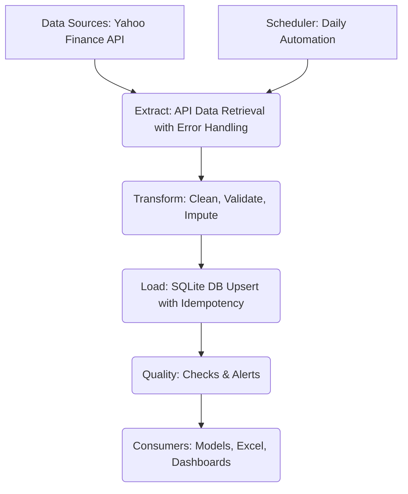

id: 698f9b2e53049d8a753b8e92_user_guide
summary: Lab 10: Automating Data Ingestion User Guide
feedback link: https://docs.google.com/forms/d/e/1FAIpQLSfWkOK-in_bMMoHSZfcIvAeO58PAH9wrDqcxnJABHaxiDqhSA/viewform?usp=sf_link
environments: Web
status: Published
# QuLab: Automating Market Data Ingestion for Investment Research

## 1. Understanding the Need for Automated Data Ingestion
Duration: 05:00

Welcome to **QuLab: Lab 10: Automating Data Ingestion**! This codelab will guide you through a Streamlit application designed to tackle a common challenge in investment research: the manual, time-consuming, and error-prone process of ingesting market data.

<aside class="positive">
This application demonstrates how a robust **Extract-Transform-Load (ETL)** pipeline, built with Python, can automate the daily retrieval, cleaning, validation, and storage of crucial market data. By the end of this codelab, you will understand the operational and strategic benefits of such a system, focusing on **data quality, efficiency, and return on investment (ROI)**.
</aside>

On the initial "Overview" page, you'll find the core problem statement that this application addresses. Manual data entry is a significant bottleneck, consuming valuable time and introducing errors, which can compromise the integrity of investment decisions and downstream analytical models. This application provides a solution to liberate financial professionals from these low-value data wrangling tasks.

### ETL Architecture Overview (V1)
The application begins by illustrating the foundational architecture of the automated market data pipeline. This system is built upon the classic ETL pattern, enhanced with robust quality checks and designed for scheduled execution.



The diagram outlines the key stages:
*   **Extract**: Data is fetched from external financial APIs, incorporating error handling for resilience.
*   **Transform**: Raw data undergoes essential cleaning, validation, and imputation to ensure accuracy and consistency.
*   **Load**: The processed data is stored in a local SQLite database using an idempotent approach, preventing duplicates.
*   **Quality**: Automated checks verify data freshness, completeness, and validity after loading.
*   **Scheduler**: (Conceptually) The entire pipeline is designed to run automatically at defined intervals.
*   **Consumers**: The high-quality data becomes readily available for investment models, dashboards, and other analytical tools.

This architectural overview sets the stage for understanding the subsequent functionalities of the application.

## 2. Executing the Automated Data Pipeline
Duration: 03:00

Navigate to the "Run Pipeline" page using the sidebar. This section of the application allows you to interact directly with the ETL process.

In a real-world production environment, this pipeline would execute automatically on a schedule, perhaps daily after market close. However, for demonstration and testing purposes, this interface provides a manual trigger.

You will see an information box indicating the **Last Pipeline Run** timestamp and its status. This provides immediate feedback on the health of your data ingestion process.

Click the **"Run Full ETL Pipeline Now"** button.

<aside class="positive">
The application will display a spinner, indicating that the pipeline is executing. This process involves connecting to external data sources, retrieving data, cleaning it, performing validation, and finally storing it in the local SQLite database. It also re-runs quality checks and ROI calculations.
</aside>

Once the pipeline completes, you will see a success message and celebratory balloons, confirming that the process has finished. The "Last Pipeline Run" status will update, and new entries will appear in the "Latest Quality Check Summary" and "Pipeline Execution Log (Latest)" sections.

The "Latest Quality Check Summary" will display a table showing key data quality metrics (e.g., freshness, completeness, price validity) for each ticker processed during the run. The "Pipeline Execution Log (Latest)" provides a detailed, timestamped record of each step, warnings, and any errors encountered during the execution. This log is crucial for debugging and auditing.

## 3. Verifying Data Quality and Integrity
Duration: 07:00

Move to the "Data Verification & Quality" page from the sidebar. This section is dedicated to visually inspecting and confirming the integrity of the ingested market data, directly reflecting the "Transform" and "Quality" stages of our ETL pipeline.

### Raw Market Data Viewer
This interactive viewer allows you to query and inspect the raw OHLCV (Open, High, Low, Close, Volume) data directly from the `market_data.db` SQLite database.

1.  **Select Ticker(s)**: Use the multi-select box to choose one or more tickers you wish to examine.
2.  **Define Date Range**: Specify a "Start Date" and "End Date" to narrow down your data query.
3.  **Load Data**: Click the "Load Raw Data for View" button.

The application will then display a table containing the market data for your selected parameters, allowing you to perform quick spot-checks on the ingested information. This is vital for confirming that data for specific dates and tickers has been correctly loaded.

### Price Series Verification (V2)
Further down, you'll find line plots illustrating the most recent 30 days of closing price data for the tickers selected in the **sidebar**. This visualization serves as a quick visual confirmation that the data for your key assets is flowing accurately and consistently. Each ticker will have its own subplot, making it easy to compare price movements.

### Quality Dashboard (V3)
The "Quality Dashboard" presents a heatmap that visualizes the results of critical data quality checks for each ticker. This gives you an immediate, color-coded overview of your data's health:
*   **Green (1)**: Indicates a **Pass** for that quality metric.
*   **Red (0)**: Indicates a **Fail** for that quality metric.

The heatmap typically checks metrics like data freshness, completeness, price validity, and detection of extreme price movements, providing a high-level summary of data integrity.

### Data Completeness Over Time (V5)
Data completeness is a fundamental aspect of data quality. This section uses a bar chart to display the **Data Completeness Ratio ($C_i$)** for a selected ticker. This metric confirms consistent data delivery against an expected threshold.

The completeness ratio for each ticker $i$ is calculated as:
$$ C_i = \frac{N_{actual,i}}{N_{expected,i}} $$
where $N_{actual,i}$ is the number of actual trading days with data for ticker $i$, and $N_{expected,i}$ is the expected number of business days (excluding weekends) in the relevant date range. A typical target is $C_i > 0.98$, allowing for rare holidays or market closures.

Use the dropdown to select a ticker, and the bar chart will update to show its completeness ratio from the latest pipeline run, along with a red dashed line indicating the target completeness.

### Latest Daily Data Quality Report
Finally, a detailed table provides a comprehensive summary of the latest data quality checks. This interactive table shows the pass/fail status for each specific metric, per ticker, offering granular insights into any potential data quality issues.

## 4. Analyzing Pipeline Performance and Return on Investment (ROI)
Duration: 04:00

Proceed to the "Performance & ROI" page from the sidebar. This section quantifies the business value of the automated pipeline by showcasing its efficiency and the tangible return on investment.

### Pipeline Execution Timeline (V4 - Partial)
While a detailed, step-by-step visual timeline (like a Gantt chart) isn't directly presented here, this section confirms the **Overall Pipeline Run Status** and **Last Pipeline Run Timestamp**. These indicators are critical for monitoring the operational health of the pipeline.

<aside class="positive">
The `pipeline.log` (visible in the log viewer below) provides timestamped entries for each major step. This log serves as an audit trail, allowing for manual analysis of execution order, duration of each step, and identification of any performance bottlenecks.
</aside>

### ROI Comparison Chart (V6)
Quantifying the ROI of automation is crucial for justifying investment in such systems. This chart visually compares the annual time investment for manual data ingestion versus the automated pipeline, highlighting the significant time savings.

The annual time saved ($\Delta T$) by automation is calculated using the following formula:
$$ \Delta T = T_{manual} \times D_{annual} - T_{setup} - T_{maint} $$
where:
*   $T_{manual}$ is the estimated daily manual effort (in hours) to collect and process data.
*   $D_{annual}$ is the annual number of trading days.
*   $T_{setup}$ is the one-time pipeline development and initial setup cost (in hours).
*   $T_{maint}$ is the estimated annual maintenance effort (in hours) for the automated pipeline.

The bar chart visually represents the annual hours spent on the "Manual Process" versus the "Automated Pipeline," clearly showing the reduction in effort. You'll also see a numerical summary of the **Calculated Annual Time Savings** and the stark contrast in **Expected Daily Errors Eliminated** between manual and automated processes. This demonstrates how automation significantly reduces human error, leading to more reliable data for investment models.

### Pipeline Execution Log Viewer
This dedicated viewer displays the contents of the `pipeline.log` file. This log is a comprehensive audit trail of every execution step, including information messages, warnings, and errors. It's an indispensable tool for debugging issues, monitoring pipeline health, and ensuring compliance.

```console
# Example snippet from the log viewer
2023-10-27 10:30:01,123 | INFO | Starting full ETL pipeline run.
2023-10-27 10:30:01,125 | INFO | Initializing database connection...
2023-10-27 10:30:01,130 | INFO | Extracting data for AAPL...
2023-10-27 10:30:02,500 | INFO | Data for AAPL extracted successfully.
2023-10-27 10:30:02,510 | INFO | Transforming data for AAPL...
2023-10-27 10:30:02,600 | INFO | Loading data for AAPL into database.
2023-10-27 10:30:02,650 | INFO | Upserted 250 records for AAPL.
...
2023-10-27 10:30:15,000 | INFO | Running quality checks.
2023-10-27 10:30:16,500 | INFO | All quality checks completed.
2023-10-27 10:30:16,600 | INFO | Pipeline run finished successfully.
```

## 5. System Integrity and Production Readiness
Duration: 06:00

Finally, navigate to the "System Integrity & Production" page. This section addresses crucial considerations for transitioning a functional prototype into a reliable, enterprise-grade production system.

### Pytest Results Summary
Automated tests are paramount for ensuring data integrity. This section reports on the status of database integrity checks, which are typically implemented using testing frameworks like Pytest in a real-world scenario.

If the checks pass:
<aside class="positive">
You'll see a success message indicating that **all automated database integrity checks PASSED successfully!** This confirms that the database structure and content are healthy, with checks typically covering: table existence, sufficient data for tickers, absence of future dates, positive closing prices, and no duplicate records.
</aside>
If issues are detected:
<aside class="negative">
An error message will alert you to **database integrity issues**, recommending a review of logs and raw data.
</aside>

These checks act as a crucial safeguard against corrupted or incomplete data, validating that the pipeline's output meets defined quality standards.

### From Script to System: The Production Gap
This section highlights the critical difference between a working script and a robust production system. The application demonstrates core functionalities, but a production deployment requires additional enterprise-grade considerations:
*   **Secrets Management**: Securely handling sensitive API keys (e.g., using specialized tools instead of hardcoding).
*   **Containerization**: Packaging the application and its dependencies (e.g., with Docker) for consistent deployment.
*   **Orchestration**: Using tools like Apache Airflow or Prefect to manage complex task dependencies, scheduling, and error handling.
*   **Monitoring & Alerting**: Implementing dashboards and alerts to track pipeline health, resource usage, and data quality in real-time.
*   **CI/CD Pipelines**: Automating the testing, building, and deployment of code changes for efficiency and reliability.

Understanding this "production gap" is essential for financial professionals aiming to build scalable and maintainable data infrastructure.

### Free vs. Paid Data: The Trade-off
The pipeline uses a free data source (Yahoo Finance API) for demonstration. This section explains the critical trade-offs between free and paid data sources in a financial production environment:
*   **Free APIs**: Offer great flexibility for learning and prototyping but typically lack SLAs, have strict rate limits, offer no dedicated support, and may have less complete or reliable data.
*   **Paid Data Providers**: (e.g., Bloomberg, Refinitiv, FactSet) Involve significant costs but provide robust SLAs, guaranteed data quality and availability, comprehensive historical data, and dedicated technical support.

<aside class="positive">
A key takeaway is that the core ETL architecture, especially the 'Transform' and 'Load' stages, is largely source-agnostic. Upgrading to a paid data source primarily involves modifying only the 'Extract' layer, making the system adaptable to enterprise-grade data providers without a full re-architecture.
</aside>

This concludes your guided tour of the "Automating Market Data Ingestion" application. You should now have a comprehensive understanding of its functionalities, the underlying concepts of data pipelines, and the critical considerations for building production-ready data solutions in finance.
